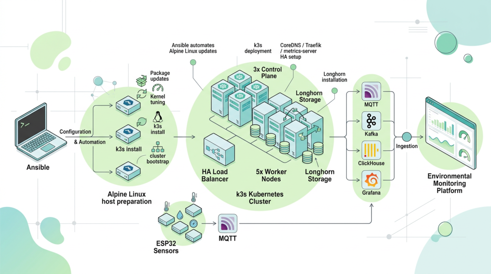

# alpine-k3s

[https://github.com/pvamos/alpine-k3s](https://github.com/pvamos/alpine-k3s)

Ansible automation for preparing **Alpine Linux** hosts and deploying a small **high-availability k3s Kubernetes cluster** with **Longhorn** storage.

This repository is intended for bare VPS-style nodes where Alpine Linux is already installed and reachable over SSH. The playbook prepares the operating system, installs k3s, joins control-plane and worker nodes, configures core cluster components, and deploys Longhorn with custom StorageClasses.



> **Public repository note:** the private version of this repository is used to deploy real infrastructure and contains values such as public IP addresses, DNS names, SSH usernames, SSH ports, local filesystem paths, hostnames, city/provider metadata, and a k3s cluster token.
> The public repository contains placeholder values only.
> Replace the placeholders with your real deployment values before use, either by editing a private clone directly or by keeping the public files unchanged and supplying a private inventory and private variable file.
> See [Replace placeholders before use](https://github.com/pvamos/alpine-k3s/tree/main#-replace-placeholders-before-use).

---

## 👨‍🔬 Author

**Péter Vámos**

* [https://github.com/pvamos](https://github.com/pvamos)
* [https://linkedin.com/in/pvamos](https://linkedin.com/in/pvamos)
* [pvamos@gmail.com](mailto:pvamos@gmail.com)

---

## 🎓 Academic context

This project is part of the infrastructure work supporting the author's **2026 thesis project**
for the **Expert in Applied Environmental Studies BSc** program at **John Wesley Theological College, Budapest**.

The cluster is used as infrastructure for an environmental monitoring stack built around ESP32 sensor nodes,
VerneMQ MQTT, Apache Kafka, Kafka Connect, Longhorn persistent storage,
custom Erlang and Java based data-processing services, ClickHouse DB and Grafana.

---

## 📜 Overview

The main playbook is:

```bash
alpine-k3s.yaml
```

It runs against the `controlplane` and `worker` Ansible inventory groups and applies these roles:

* ✅ `alpine_latest` — switches Alpine APK repositories to the configured stable release and upgrades packages
* ✅ `alpine_kernelparams` — configures kernel modules, forwarding, cgroup v2 and OpenRC limits required by Kubernetes/k3s
* ✅ `alpine_k3s_config` — bootstraps the k3s cluster, joins control-plane and worker nodes, fetches kubeconfig and configures bundled components
* ✅ `alpine_k3s_coredns` — patches CoreDNS replicas, scheduling and PodDisruptionBudget
* ✅ `alpine_longhorn` — installs Longhorn prerequisites, deploys Longhorn with Helm and creates custom replication-factor StorageClasses

---

## 🧭 What the project does now

The current repository state is optimized for a fixed HA k3s topology:

* **3 control-plane nodes**
  * one initial bootstrap node in the `control1` group
  * additional servers in the `control23` group
* **5 worker nodes** in the `worker` group
* **external API load balancer endpoint** used by additional control-plane nodes and workers
* **k3s installed through `get.k3s.io`** using a pinned `k3s_version`
* **Flannel VXLAN** networking on a configured network interface
* **CoreDNS**, **Traefik** and **metrics-server** moved toward HA operation
* **control-plane taints** applied to keep normal workloads off control-plane nodes
* **worker and Kafka labels** applied to worker nodes
* **Longhorn v1.10.1** installed through the Longhorn Helm chart
* **Longhorn default disks** created only on explicitly labelled nodes
* custom Longhorn StorageClasses for replica counts **1**, **2** and **3**
* the replica-count-2 Longhorn StorageClass is configured as the default in the current variable model

The playbook is not a generic k3s installer yet. Several assumptions are encoded directly in variables and tasks, especially node counts, node names, control-plane groups, worker names, load balancer addresses and local user paths.

---

## 📁 Project directory structure

```text
alpine-k3s/
|
├── alpine-k3s.yaml                  # Main Ansible playbook
├── ansible.cfg                      # Ansible SSH/profile settings
├── hosts                            # Inventory; should contain placeholders in the public repo
├── group_vars/
│   ├── all                          # Main cluster variables; public version should contain placeholders only
│   ├── controlplane
│   ├── haproxy
│   ├── registry
│   ├── traefik
│   └── workers
├── roles/
│   ├── alpine_latest/               # APK repository and package upgrade role
│   ├── alpine_kernelparams/         # Kernel, sysctl, cgroup and OpenRC preparation
│   ├── alpine_k3s_config/           # k3s bootstrap, joining, kubeconfig, labels and bundled component patches
│   ├── alpine_k3s_coredns/          # CoreDNS HA patch and PDB
│   └── alpine_longhorn/             # Longhorn requirements, Helm deployment and StorageClasses
├── files/
│   ├── repositories.latest          # Alpine APK repository list
│   ├── longhorn_values.1.10.1.yaml  # Active customized Longhorn values file
│   ├── longhorn_values.*.default.yaml
│   ├── pdb-*.yaml
│   └── longhorn-post-renderer.sh
├── templates/
│   └── traefik-config.yaml.j2       # k3s Traefik HelmChartConfig template
└── README.md
```

---

## ⚙️ Prerequisites

### Control machine

The machine running Ansible should have:

* Ansible
* SSH access to all target nodes
* Python packages/collections required by the playbooks
* `kubectl` access after kubeconfig is fetched
* an SSH key accepted by all target nodes

Example collection installation:

```bash
ansible-galaxy collection install \
  community.general \
  kubernetes.core \
  ansible.posix
```

### Target nodes

The playbook assumes Alpine Linux hosts with:

* SSH access enabled
* Python 3 available at `/usr/bin/python3`
* privilege escalation through `sudo`
* `curl` available for the k3s install script
* network connectivity between all nodes
* an external load balancer or HAProxy endpoint for the Kubernetes API
* a disk layout compatible with Longhorn and the configured node labels

---

## 🧱 Role details

### `alpine_latest`

This role:

* replaces `/etc/apk/repositories` with `files/repositories.latest`
* upgrades installed APK packages
* reboots the host after the upgrade

The current repository file points to Alpine `v3.23` `main` and `community` repositories, with edge repositories commented out.

### `alpine_kernelparams`

This role prepares Alpine for k3s and Longhorn by:

* enabling IPv4 forwarding
* enabling bridge netfilter for iptables
* loading modules such as `br_netfilter`, `overlay`, `dm_crypt` and `iscsi_tcp`
* installing `linux-virt`, `linux-virt-dev` and `iptables`
* increasing OpenRC service file descriptor limits
* enabling cgroup v2 through `update-extlinux`
* enabling the OpenRC `cgroups` service
* rebooting and verifying cgroup v2 availability

### `alpine_k3s_config`

This role performs the main cluster bootstrap:

* maps each node's detected IP address to configured host metadata
* initializes the first control-plane node with `--cluster-init`
* joins the remaining control-plane nodes through the load balancer endpoint
* joins workers as k3s agents
* fetches `/etc/rancher/k3s/k3s.yaml` from the first control-plane node
* rewrites kubeconfig server and context values to use the public load balancer endpoint
* copies kubeconfig back to nodes
* labels control-plane nodes for k3s service load balancer use
* taints control-plane nodes with `node-role.kubernetes.io/control-plane:NoSchedule`
* renders Traefik `HelmChartConfig` with trusted HAProxy/load-balancer IPs
* patches CoreDNS and metrics-server toward two replicas on control-plane nodes
* creates PDBs for CoreDNS, Traefik and metrics-server
* labels worker nodes as workers and Kafka-capable nodes
* reboots nodes and prints final node/pod status

### `alpine_k3s_coredns`

This role separately patches CoreDNS with:

* configurable replica count
* pod anti-affinity
* control-plane node affinity
* control-plane tolerations
* a CoreDNS PodDisruptionBudget

### `alpine_longhorn`

This role installs and configures Longhorn by:

* installing packages such as `open-iscsi`, `nfs-utils`, `helm`, `jq`, `yq` and supporting Python packages
* enabling the OpenRC `local` service
* installing a boot-time mount propagation script under `/etc/local.d/`
* enabling and starting `iscsid`
* labelling worker nodes with `node.longhorn.io/create-default-disk=true`
* adding the Longhorn Helm repository
* installing Longhorn chart version `1.10.1` using `files/longhorn_values.1.10.1.yaml`
* applying PDBs for Longhorn Manager and Longhorn CSI plugin
* making the built-in `local-path` and default `longhorn` StorageClasses non-default
* patching Longhorn CSI controller deployments onto control-plane nodes
* creating custom StorageClasses:
  * `longhorn-rf1`
  * `longhorn-rf2`
  * `longhorn-rf3`

The current variable model makes `longhorn-rf2` the default StorageClass.

---

## 🧩 Longhorn behavior

The customized Longhorn values and post-install tasks currently aim for this layout:

* Longhorn installed into the `longhorn-system` namespace
* Longhorn chart version `1.10.1`
* default Longhorn replica count: **2**
* CSI sidecar replicas: **2**
* default disks created only on labelled nodes
* Longhorn UI pinned to control-plane nodes
* Longhorn driver deployer pinned to control-plane nodes
* CSI controller deployments patched to control-plane nodes after Helm installation
* Longhorn Manager tolerates control-plane taints
* custom RF1/RF2/RF3 StorageClasses are applied after installation

---

## 🚀 Deployment steps

### 1️⃣ Clone the repository

```bash
git clone https://github.com/pvamos/alpine-k3s.git
cd alpine-k3s
```

### 2️⃣ Replace placeholders with real values

Before running the playbook, replace placeholder inventory, SSH, node, load-balancer, k3s-token and Longhorn values with real values for your own infrastructure.

You can do this in one of two ways:

1. edit the placeholder files directly in a private clone, or
2. keep the public files unchanged and provide real values from a private inventory and a private variable file.

Both methods are described in [Replace placeholders before use](#-replace-placeholders-before-use).

### 3️⃣ Run the playbook

If you edited the placeholder files directly in your private clone:

```bash
ansible-playbook -i hosts alpine-k3s.yaml
```

If you keep real values outside the public repository:

```bash
ansible-playbook \
  -i ../private-alpine-k3s/hosts \
  -e @../private-alpine-k3s/cluster-vars.yaml \
  alpine-k3s.yaml
```

With Ansible Vault:

```bash
ansible-vault encrypt ../private-alpine-k3s/cluster-vars.vault.yaml

ansible-playbook \
  -i ../private-alpine-k3s/hosts \
  -e @../private-alpine-k3s/cluster-vars.vault.yaml \
  --ask-vault-pass \
  alpine-k3s.yaml
```

---

## 🧰 Replace placeholders before use

The public repository should contain documentation-safe placeholder values, not live infrastructure data.
Before using the playbook for a real cluster, replace the placeholders with values for your own VPS nodes, domain names, SSH access pattern, load balancer and k3s cluster token.

There are two supported workflows.

---

### 1️⃣ Edit the placeholder files directly in a private clone

Use this workflow if you cloned the repository for your own deployment and do **not** plan to push your modified files back to a public remote.

#### Step 1: edit `hosts`

Replace the example hostnames and documentation IP addresses with your real control-plane and worker nodes.

Public placeholder example:

```ini
[controlplane]
control1.example.com ansible_host=203.0.113.11
control2.example.com ansible_host=203.0.113.12
control3.example.com ansible_host=203.0.113.13

[control1]
control1.example.com ansible_host=203.0.113.11

[control23]
control2.example.com ansible_host=203.0.113.12
control3.example.com ansible_host=203.0.113.13

[worker]
worker1.example.com ansible_host=203.0.113.21
worker2.example.com ansible_host=203.0.113.22
worker3.example.com ansible_host=203.0.113.23
worker4.example.com ansible_host=203.0.113.24
worker5.example.com ansible_host=203.0.113.25
```

Private real-use example:

```ini
[controlplane]
control1.your-domain.example ansible_host=<real-control-1-public-ip>
control2.your-domain.example ansible_host=<real-control-2-public-ip>
control3.your-domain.example ansible_host=<real-control-3-public-ip>

[control1]
control1.your-domain.example ansible_host=<real-control-1-public-ip>

[control23]
control2.your-domain.example ansible_host=<real-control-2-public-ip>
control3.your-domain.example ansible_host=<real-control-3-public-ip>

[worker]
worker1.your-domain.example ansible_host=<real-worker-1-public-ip>
worker2.your-domain.example ansible_host=<real-worker-2-public-ip>
worker3.your-domain.example ansible_host=<real-worker-3-public-ip>
worker4.your-domain.example ansible_host=<real-worker-4-public-ip>
worker5.your-domain.example ansible_host=<real-worker-5-public-ip>
```

Keep the inventory group names unless you also update the playbook and role logic. The current roles expect:

```text
controlplane
control1
control23
worker
```

#### Step 2: edit SSH and controller-local values in `group_vars/all`

Replace the SSH user, SSH port, key paths and local kubeconfig path.

Placeholder example:

```yaml
ansible_port: 22
ansible_user: alpine-admin
ansible_add_user: alpine-admin
ansible_ssh_private_key_file: ~/.ssh/id_ed25519
ansible_user_publickey: ~/.ssh/id_ed25519.pub
ansible_local_kubeconfig: ~/.kube/config
```

Private real-use example:

```yaml
ansible_port: <your-ssh-port>
ansible_user: <your-ssh-user>
ansible_add_user: <your-ssh-user>
ansible_ssh_private_key_file: ~/.ssh/<your-private-key>
ansible_user_publickey: ~/.ssh/<your-public-key>.pub
ansible_local_kubeconfig: ~/.kube/config
```

If the roles contain controller-local absolute paths such as `/home/<user>/alpine-k3s/...` or `/home/<user>/.kube/config`, replace them with variables so the playbook is portable:

```yaml
ansible_controller_workdir: "{{ playbook_dir }}"
ansible_local_kubeconfig: "{{ lookup('env', 'HOME') }}/.kube/config"
longhorn_values_remote_path: /tmp/longhorn_values.1.10.1.yaml
```

Then update task references to use those variables, for example:

```yaml
{{ ansible_controller_workdir }}/k3s.yaml
{{ ansible_local_kubeconfig }}
{{ longhorn_values_remote_path }}
```

#### Step 3: generate and set a real `k3s_token`

Generate a unique token for every real cluster:

```bash
openssl rand -hex 32
```

Then replace the placeholder in `group_vars/all`:

```yaml
k3s_token: "<real-random-token-generated-for-this-cluster>"
```

Do not reuse a token from an old private repository or from another cluster.

#### Step 4: edit load balancer, DNS and cluster-network values

Replace the load balancer placeholders with your real Kubernetes API endpoint.

Placeholder example:

```yaml
loadbalancer_ipv4: 203.0.113.10
loadbalancer_port: 6443
loadbalancer_node_port: 6443
loadbalancer_fqdn: k8s.example.com
dns_search: example.com
```

Private real-use example:

```yaml
loadbalancer_ipv4: <real-load-balancer-public-ip>
loadbalancer_port: 6443
loadbalancer_node_port: 6443
loadbalancer_fqdn: <real-kubernetes-api-fqdn>
dns_search: <your-domain.example>
```

Review the cluster network settings before changing them. The defaults below are common k3s defaults and are usually safe unless they overlap with your real network:

```yaml
cluster_cidr: "10.42.0.0/16"
service_cidr: "10.43.0.0/16"
service_node_port_range: "30000-32767"
cluster_dns: "10.43.0.10"
```

#### Step 5: edit node IP lists and node metadata

Replace every documentation IP address with your real node IPs.

Placeholder example:

```yaml
control_plane_ips:
  - 203.0.113.11
  - 203.0.113.12
  - 203.0.113.13

worker_ips:
  - 203.0.113.21
  - 203.0.113.22
  - 203.0.113.23
  - 203.0.113.24
  - 203.0.113.25
```

Private real-use example:

```yaml
control_plane_ips:
  - "<real-control-1-public-ip>"
  - "<real-control-2-public-ip>"
  - "<real-control-3-public-ip>"

worker_ips:
  - "<real-worker-1-public-ip>"
  - "<real-worker-2-public-ip>"
  - "<real-worker-3-public-ip>"
  - "<real-worker-4-public-ip>"
  - "<real-worker-5-public-ip>"
```

Also replace any per-node metadata placeholders, if present:

```yaml
api_fqdn: <real-api-fqdn>
api_domain: <real-domain>
api_ipv4addr: <real-api-ipv4>
api_ipv6addr: <real-api-ipv6>
api_ipv6_defaultgw: <real-ipv6-default-gateway>
api_city: <real-city-or-site-label>

c1_fqdn: <real-control-1-fqdn>
c2_fqdn: <real-control-2-fqdn>
c3_fqdn: <real-control-3-fqdn>
w1_fqdn: <real-worker-1-fqdn>
w2_fqdn: <real-worker-2-fqdn>
w3_fqdn: <real-worker-3-fqdn>
w4_fqdn: <real-worker-4-fqdn>
w5_fqdn: <real-worker-5-fqdn>
```

#### Step 6: set the real Flannel interface

The default placeholder may not match your VPS provider's network interface name.
Check the real interface on each target node:

```bash
ip route get 1.1.1.1
ip addr
```

Then set:

```yaml
flannel_backend: vxlan
flannel_interface: <real-primary-network-interface>
```

Examples:

```yaml
flannel_interface: eth0
```

or:

```yaml
flannel_interface: ens3
```

All nodes should use the interface that carries node-to-node traffic.

#### Step 7: edit optional HAProxy, registry and service endpoint values

If your `group_vars/all` contains provider- or service-specific sections, replace the placeholders with your real values or remove the unused sections.

Placeholder example:

```yaml
haproxy_api: 203.0.113.10
haproxy_mqtt1: 203.0.113.31
haproxy_mqtt2: 203.0.113.32
haproxy_mqtt3: 203.0.113.33
haproxy_lb1: 203.0.113.34

reg_fqdn: reg.example.com
reg_domain: example.com
reg_ipv4addr: 203.0.113.40
reg_ipv6addr: 2001:db8::40
reg_city: Example City
```

Private real-use example:

```yaml
haproxy_api: <real-api-load-balancer-ip>
haproxy_mqtt1: <real-mqtt-load-balancer-ip-1>
haproxy_mqtt2: <real-mqtt-load-balancer-ip-2>
haproxy_mqtt3: <real-mqtt-load-balancer-ip-3>
haproxy_lb1: <real-general-load-balancer-ip>

reg_fqdn: <real-registry-fqdn>
reg_domain: <real-domain>
reg_ipv4addr: <real-registry-ipv4>
reg_ipv6addr: <real-registry-ipv6>
reg_city: <real-city-or-site-label>
```

#### Step 8: edit Longhorn values

Review the active Longhorn values file:

```text
files/longhorn_values.1.10.1.yaml
```

If Longhorn UI ingress is enabled or later enabled, replace the placeholder hostname:

```yaml
longhornUI:
  ingress:
    enabled: false
    ingressClassName: traefik
    host: longhorn.example.com
    tls: false
```

Private real-use example:

```yaml
longhornUI:
  ingress:
    enabled: true
    ingressClassName: traefik
    host: <real-longhorn-ui-fqdn>
    tls: false
```

If you later enable Longhorn backups, private registries or S3-compatible object storage, do not commit real access keys, secret keys, bucket names or backup credentials. Store those values in Ansible Vault or Kubernetes Secrets.

#### Step 9: check that no placeholders remain before running

Search for obvious placeholder values:

```bash
grep -RInE 'CHANGE_ME|example\.com|203\.0\.113\.|2001:db8|<real-|<your-|<provider-|/home/<user>' \
  --exclude-dir=.git \
  .
```

Some placeholder values may intentionally remain in documentation files. For actual execution, make sure the files used by Ansible contain real values.

Then test inventory connectivity:

```bash
ansible -i hosts all -m ping
```

Run a syntax check:

```bash
ansible-playbook -i hosts alpine-k3s.yaml --syntax-check
```

Finally, run the playbook:

```bash
ansible-playbook -i hosts alpine-k3s.yaml
```

---

### 2️⃣ Keep public files unchanged and use private inventory/private variables

Use this workflow if you want to keep the Git checkout clean, avoid accidentally committing real infrastructure values, or contribute changes back to the public repository.

Recommended layout:

```text
projects/
├── alpine-k3s/                  # public Git repository
└── private-alpine-k3s/          # not committed to public Git
    ├── hosts
    ├── cluster-vars.yaml
    └── cluster-vars.vault.yaml  # optional encrypted secrets
```

#### Step 1: create a private inventory

Create:

```text
../private-alpine-k3s/hosts
```

Example:

```ini
[controlplane]
control1.your-domain.example ansible_host=<real-control-1-public-ip>
control2.your-domain.example ansible_host=<real-control-2-public-ip>
control3.your-domain.example ansible_host=<real-control-3-public-ip>

[control1]
control1.your-domain.example ansible_host=<real-control-1-public-ip>

[control23]
control2.your-domain.example ansible_host=<real-control-2-public-ip>
control3.your-domain.example ansible_host=<real-control-3-public-ip>

[worker]
worker1.your-domain.example ansible_host=<real-worker-1-public-ip>
worker2.your-domain.example ansible_host=<real-worker-2-public-ip>
worker3.your-domain.example ansible_host=<real-worker-3-public-ip>
worker4.your-domain.example ansible_host=<real-worker-4-public-ip>
worker5.your-domain.example ansible_host=<real-worker-5-public-ip>
```

#### Step 2: create a private variable file

Create:

```text
../private-alpine-k3s/cluster-vars.yaml
```

Example:

```yaml
ansible_port: <your-ssh-port>
ansible_user: <your-ssh-user>
ansible_add_user: <your-ssh-user>
ansible_ssh_private_key_file: ~/.ssh/<your-private-key>
ansible_user_publickey: ~/.ssh/<your-public-key>.pub
ansible_local_kubeconfig: ~/.kube/config

k3s_version: "v1.35.0+k3s1"
k3s_token: "<real-random-token-generated-for-this-cluster>"

loadbalancer_ipv4: <real-load-balancer-public-ip>
loadbalancer_port: 6443
loadbalancer_node_port: 6443
loadbalancer_fqdn: <real-kubernetes-api-fqdn>
dns_search: <your-domain.example>

cluster_cidr: "10.42.0.0/16"
service_cidr: "10.43.0.0/16"
service_node_port_range: "30000-32767"
cluster_dns: "10.43.0.10"

flannel_backend: vxlan
flannel_interface: <real-primary-network-interface>

control_plane_ips:
  - "<real-control-1-public-ip>"
  - "<real-control-2-public-ip>"
  - "<real-control-3-public-ip>"

worker_ips:
  - "<real-worker-1-public-ip>"
  - "<real-worker-2-public-ip>"
  - "<real-worker-3-public-ip>"
  - "<real-worker-4-public-ip>"
  - "<real-worker-5-public-ip>"

longhorn_namespace: longhorn-system
```

Generate the token before filling in the file:

```bash
openssl rand -hex 32
```

#### Step 3: use Ansible Vault for secrets

For sensitive values such as `k3s_token`, private registry credentials, backup-store credentials or future service passwords, prefer Ansible Vault.

Create an encrypted file:

```bash
ansible-vault create ../private-alpine-k3s/cluster-vars.vault.yaml
```

Example vault content:

```yaml
k3s_token: "<real-random-token-generated-for-this-cluster>"
```

Run with the vault file:

```bash
ansible-playbook \
  -i ../private-alpine-k3s/hosts \
  -e @../private-alpine-k3s/cluster-vars.yaml \
  -e @../private-alpine-k3s/cluster-vars.vault.yaml \
  --ask-vault-pass \
  alpine-k3s.yaml
```

#### Step 4: run without modifying public files

Run from the public repository directory:

```bash
cd alpine-k3s

ansible-playbook \
  -i ../private-alpine-k3s/hosts \
  -e @../private-alpine-k3s/cluster-vars.yaml \
  alpine-k3s.yaml
```

If the public `group_vars/all` already contains placeholder defaults, the private variable file overrides them. Values passed with `-e @file.yaml` have high precedence, so they are suitable for deployment-specific overrides.

#### Step 5: keep private files out of Git

If the private directory is inside or near your project workspace, verify that it is ignored:

```gitignore
private/
../private-alpine-k3s/
*.local.yaml
*.local.yml
private*.yaml
private*.yml
ansible-vault-password*
.vault-pass*
```

Before committing public changes, check that only public-safe files are staged:

```bash
git status
git diff --cached
```

---

## ⚠️ Operational cautions

This playbook performs invasive operations on target hosts:

* upgrades all installed Alpine packages
* rewrites `/etc/apk/repositories`
* modifies kernel parameters and boot options
* reboots machines multiple times
* installs k3s using a remote shell installer
* modifies `/etc/rancher/k3s/k3s.yaml`
* applies Kubernetes labels and taints
* patches k3s-managed manifests for CoreDNS, metrics-server and Traefik
* installs and patches Longhorn

Review variables and inventory carefully before running it on any machine that contains important data.

---

## 🔬 Troubleshooting

### Ansible cannot connect

Check SSH host, port, username and key path:

```bash
ansible -i hosts all -m ping
```

If Python is missing on the Alpine host, install it first:

```bash
apk add python3 sudo
```

### cgroup v2 check fails

Verify that `/etc/update-extlinux.conf` contains the expected kernel options and that the host rebooted successfully:

```bash
stat -fc %T /sys/fs/cgroup
ls -l /sys/fs/cgroup/cgroup.controllers
```

Expected filesystem type:

```text
cgroup2fs
```

### k3s nodes do not join

Check:

* `k3s_token` matches on all nodes
* the load balancer forwards TCP `6443` to the control-plane servers
* control-plane TLS SANs include the load balancer IP/FQDN and control-plane IPs/FQDNs
* firewalls allow node-to-node traffic required by k3s and Flannel
* `flannel_interface` matches the real network interface

### CoreDNS, Traefik or metrics-server not scheduled

Check control-plane labels and taints:

```bash
kubectl get nodes --show-labels
kubectl describe node control1
```

### Longhorn install fails

Check that required packages and services exist on every node:

```bash
rc-service iscsid status
lsmod | grep iscsi_tcp
findmnt -o TARGET,PROPAGATION /
```

Check Longhorn pods:

```bash
kubectl get pods -n longhorn-system -o wide
kubectl get storageclass
```

---

## 🧭 Roadmap / recommended improvements

* Split public defaults from private deployment variables.
* Replace hardcoded node names with inventory-driven loops.
* Make the number of control-plane and worker nodes configurable.
* Move local paths such as `/home/<user>/...` into variables.
* Replace direct `get.k3s.io` installation with an optionally configurable install method.
* Avoid copying admin kubeconfig to nodes with broad permissions.
* Reduce duplicated CoreDNS/PDB logic between roles.
* Convert embedded `kubectl apply -f -` blocks to template files where practical.
* Add `hosts.example` and `group_vars/all.example.yaml` committed to Git.
* Add CI linting with `ansible-lint` and YAML validation.

---

## ⚖️ License

MIT License

Copyright (c) 2025 Péter Vámos pvamos@gmail.com https://github.com/pvamos

Permission is hereby granted, free of charge, to any person obtaining a copy
of this software and associated documentation files (the "Software"), to deal
in the Software without restriction, including without limitation the rights
to use, copy, modify, merge, publish, distribute, sublicense, and/or sell
copies of the Software, and to permit persons to whom the Software is
furnished to do so, subject to the following conditions:

The above copyright notice and this permission notice shall be included in all
copies or substantial portions of the Software.

THE SOFTWARE IS PROVIDED "AS IS", WITHOUT WARRANTY OF ANY KIND, EXPRESS OR
IMPLIED, INCLUDING BUT NOT LIMITED TO THE WARRANTIES OF MERCHANTABILITY,
FITNESS FOR A PARTICULAR PURPOSE AND NONINFRINGEMENT. IN NO EVENT SHALL THE
AUTHORS OR COPYRIGHT HOLDERS BE LIABLE FOR ANY CLAIM, DAMAGES OR OTHER
LIABILITY, WHETHER IN AN ACTION OF CONTRACT, TORT OR OTHERWISE, ARISING FROM,
OUT OF OR IN CONNECTION WITH THE SOFTWARE OR THE USE OR OTHER DEALINGS IN THE
SOFTWARE.
